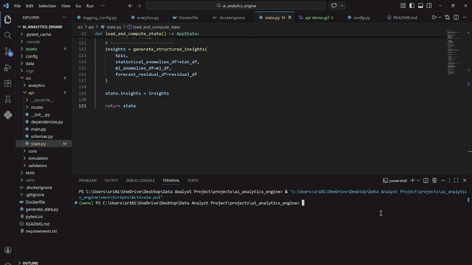

# AI-Powered Autonomous E-Commerce Analytics Engine

## Executive Overview

This project implements and serves a production-style internal analytics backend for a mid-size D2C e-commerce company.

It includes:

- Config-driven data simulation
- KPI computation engine
- Multi-model anomaly detection (Statistical + ML + Forecast residual)
- Prophet-based time series forecasting
- Structured LLM-ready insights with anomaly consensus logic
- FastAPI backend with typed schemas
- Fully containerized Docker deployment

The system demonstrates end-to-end analytics engineering from synthetic data generation to deployable production API infrastructure.

This is not a notebook project.  
It is a modular, layered, production-oriented analytics engine.

---
## API Demo



## System Architecture

The system follows a layered enterprise-style architecture:

Simulation Layer → Analytics Layer → Multi-Model Consensus → API Layer → Containerization

### Simulation Layer
- YAML-based configuration control
- Product catalog generation
- Customer simulation
- Website traffic modeling (seasonality + growth)
- Conversion rate modeling with channel bias
- Revenue event injection
- Deterministic seed for reproducibility

### Analytics Layer
- KPI computation (Revenue, AOV, Conversion Rate)
- Channel performance analysis
- Monthly revenue trend modeling
- Rolling z-score anomaly detection
- Isolation Forest ML anomaly detection
- Prophet time-series forecasting
- Residual-based anomaly detection

### Multi-Model Consensus Layer
- Statistical ∩ ML overlap detection
- ML ∩ Forecast overlap detection
- Statistical ∩ Forecast overlap detection
- Triple-confirmed anomaly detection
- Automated critical alert generation

This reduces false positives and mirrors enterprise monitoring systems.

### API Layer (FastAPI)
- Typed Pydantic schemas
- Startup precomputed analytics state
- Drill-down anomaly endpoints
- Forecast endpoint with validation constraints
- Structured insight endpoint
- Error handling and HTTP exception management
- CORS middleware
- Environment-based configuration via dotenv

### Infrastructure
- Self-bootstrapping data generation
- Docker containerization
- Portable runtime
- Reproducible execution environment

---

## Multi-Model Anomaly Detection

This engine detects anomalies using three independent models:

1. Statistical Rolling Z-Score
2. Isolation Forest (ML-based)
3. Prophet Forecast Residual Analysis

The system computes overlap sets:

- Statistical ∩ ML
- ML ∩ Forecast
- Statistical ∩ Forecast
- Triple-confirmed anomalies

Multi-model confirmation increases reliability and strengthens anomaly explainability.

---

## API Endpoints

| Endpoint | Description |
|----------|------------|
| `/kpis` | Core performance metrics |
| `/insights` | Structured executive insights |
| `/forecast` | Future revenue forecast |
| `/anomalies/statistical` | Rolling z-score anomalies |
| `/anomalies/ml` | Isolation Forest anomalies |
| `/anomalies/forecast` | Forecast residual anomalies |
| `/anomalies/consensus` | Multi-model overlap analysis |

Interactive API Documentation:
http://localhost:8000/docs

---
```
## Architecture Overview

ai_analytics_engine/
│
├── config/
│   └── simulation.yaml                # Central configuration (dates, entities, traffic, conversion, anomalies)
│
├── data/                              # Generated datasets (ignored in Git)
│   ├── products.csv
│   ├── customers.csv
│   ├── website_traffic.csv
│   └── orders.csv
│
├── logs/                              # Runtime logs (ignored in Git)
│
├── src/
│   ├── simulation/                    # Data Simulation Layer
│   │   ├── __init__.py
│   │   ├── config.py                  # YAML loader & config abstraction
│   │   ├── utils.py                   # Shared utilities (dates, logging)
│   │   ├── products.py                # Product catalog simulation
│   │   ├── customers.py               # Customer base simulation
│   │   ├── traffic.py                 # Website traffic modeling (seasonality + growth)
│   │   └── orders.py                  # Dynamic order generation (conversion modeling + event injection)
│   │
│   └── analytics/                     # Analytics & Intelligence Layer
│       ├── __init__.py
│       ├── kpis.py                    # KPI computation engine
│       ├── anomaly_detection.py       # Statistical anomaly detection (rolling z-score)
│       ├── ml_anomaly_detection.py    # Isolation Forest anomaly detection
│       ├── forecasting.py             # Prophet forecasting + residual anomaly detection
│       └── insights_engine.py         # Structured LLM-ready insight generation + anomaly consensus logic
│
├── tests/                             # Unit testing layer
│   └── test_simulation_integrity.py
│
├── generate_data.py                   # Orchestration entry point (pipeline runner)
├── requirements.txt                   # Project dependencies
├── pytest.ini                         # Test configuration
└── README.md


The system is modular and layered:

1. Simulation Layer → Generates realistic business data.  
2. Analytics Layer → Computes KPIs, anomalies, forecasts, and structured insights.  
3. Multi-Model Consensus Layer → Confirms anomalies across statistical, ML, and forecasting systems.  
4. Infrastructure Layer → Dockerized API service with reproducible runtime environment.
```
---

## Running Locally

### Install Dependencies
pip install -r requirements.txt

### Start API
uvicorn src.api.main:app --reload

Open:
http://localhost:8000/docs

---

## Running with Docker

### Build Image
docker build -t ai-analytics-engine .

### Run Container
docker run -p 8000:8000 ai-analytics-engine

Open:
http://localhost:8000/docs

---

## Example Structured Output
{
  "executive_summary": {
    "total_revenue": 538828207.94,
    "conversion_rate": 0.0227,
    "top_channel": "Organic"
  },
  "anomaly_analysis": {
    "triple_overlap": ["2025-03-15"]
  },
  "alerts": [
    "Critical anomaly confirmed by statistical, ML, and forecasting models."
  ]
}


---

## Tech Stack

- Python
- Pandas
- NumPy
- Scikit-Learn
- Prophet
- FastAPI
- Pydantic
- Docker
- python-dotenv

---

## Why This Project Matters

This project demonstrates:

- End-to-end analytics engineering
- Multi-model anomaly detection with consensus validation
- Forecast-driven residual anomaly confirmation
- Production API architecture with typed schemas
- Modular system design
- Containerized backend deployment
- Enterprise-grade analytics thinking